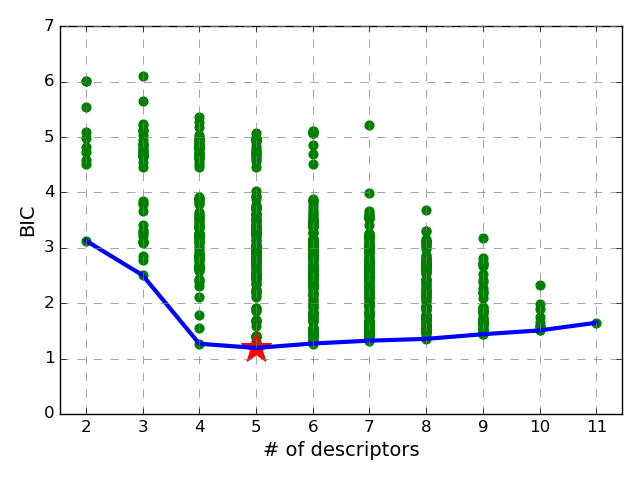

# BayesianFramework
> A framework for Bayesian model selection (BMS) and Bayesian model Averaging (BMA).  

A framework to implement Bayesian model selection and model averaging scheme to linear regression models. It can be used to identify the best model amongst several competing linear regression models. Furthermore, when the model uncertainty is high, it can be used to perform Bayesian model averaging to make reliable and robust estimation of the quantities of interest.

## Installing / Getting started

To use this package, you need the following packages:

```shell
numpy>=1.12
sklearn
matplotlib>=3.1
pandas>=0.25.1
```

After you have all the required dependency, you can download the code from github using:

```shell
git clone https://github.com/mamunm/BayesianFramework
```

Then, you can run `setup.py` to install:

```shell
python setup.py install 
```

Alternatively, you can add the file location to your `PYTHONPATH`:

```shell
export PYTHONPATH="/path/to/BayesianFramework:${PYTHONPATH}"
```


## Features

What's all the bells and whistles this project can perform?
* linreg: performs linear regression on data
* linzoo: constructs the linear regression zoo from the dataframe
* bayesframe: performs Bayesian model selction and averaging and can be used to make future prediction.

## How to use it:

### LinReg

Here, I demonstrate a simple code snippet to show how to use `bayesframe.LinReg` on any data:

```python
#import module
from bayesframe import LinReg
from sklearn.datasets import load_boston

#get the data
data = load_boston()
X = data['data'][:, 1]
y = data['target']

# Initialize the model 
lin = LinReg(X=X, y=y, val_scheme="leave_one_out")

#print model data
print(lin.get_model_data()) 
```
Running this script will produce the following output:

```shell
{'slope': array([0.14213999]), 'intercept': 20.917579117799832, 'rmse': 8.60490557714858, 'n_dp': 506}
```

Here, the `slope` and `intercept` are the model parameters, `n_dp` is the number of data points used to fit the model, and `rmse` is the model's root mean squred error. If `val_scheme` is used `None` or default, it will compute the sample variance. To approximate the population variance, you can use `leave_one_out` or `k-Fold` cross validation scheme. In the `k-Fold` scheme, you need to give an integer for the value of `k`, e.g., for 5 fold cv, use `5-Fold`. 

### LinZoo

Now, a simple demonstration of the `bayesframe.LinZoo` function:

```python
#import module
from bayesframe import load_data
from bayesframe import LinZoo

#get the data
data = load_data()

#Initialize the model
linzoo = LinZoo(df=data, target="Target", val_scheme=None, bic_scheme="per_n")

#Build the zoo 
linzoo.build_zoo()

#Plot and show the envelope
linzoo.plot_envelope().show()  
```

This will show the following plot in a matplotlib GUI:



To save a plot, use the following one liner:

```python
linzoo.plot_envelope().savefig('BIC_Envelope.png')
```

In the above code snippet for `LinZoo` demonstration, `df` is the dataframe, `target` is the column name of the target properties, `val_scheme` is same as validation scheme described in `LinReg` section, and `bic_scheme` is the scheme to compute the Bayesian Information Criteria (BIC). For equal amount of data points for each model, use `None` but for varying amount of data points, use `per_n`. Insted of passing a dataframe to instantiate the class object, you can also pass the `fpath` of the csv file.

### BayesFrame

Now, we are all set to move on to building the Bayesian Model Selection and Averaging part. The following code illustrates how to use it:

```python
#Import modeule
from bayesframe import BayesFrame
from bayesframe import load_data 
from bayesframe import load_test_data

#Load the data
data = load_data()

#Initialize the model
bframe = BayesFrame(df=data, target="Target", val_scheme=None, 
                    bic_scheme="per_n", model_scheme=["selection"])

#Print the best model
print(bframe.zoo)
```
It will print:

```shell
{'O_N_CH2_NH': {'BIC': 1.1925678847679801,
  'Delta_BIC': 0.0,
  'intercept': 1.5896455262621,
  'n_dp': 20,
  'rmse': 0.08917024884254064,
  'slope': array([-1.04318739,  0.52604511,  0.39987429,  1.14262368])}}
```

In the above code, `df` (you can also use `fpath`), `target`, `val_scheme`, and `bic_scheme` has the same meaning as `LinZoo` class. `model_scheme` is the specification of which sheme to use for model deployment. `["selection"]` will use the best model to make future prediction. To use Bayesian Model Averaging (BMA), use `["averaging", "all"]` which will use all models in the averaging scheme. If you want to use only the low lying models, use numerical value instead of "all", e.g., `0.5`  to take models which are within &sigma;<sub>o</sub>
to &sigma;<sub>o</sub> + 0.5 &sigma;<sub>o</sub> Occam's window. 

To make prediction with the model:

```python
#Load the test data
t_data = load_test_data()

#Make prediction on the test data
bframe(data=t_data, outpath="out.csv", target="Target", print_rmse=True)
```
It will print out the following line in the console:

```shell
Computed RMSE: 0.0902776566069057
```

Here, `data` is the dataframe to make prediction on. Alternatively, you can specify the path to csv file using `fpath`. `outpath` is the path to the csv file where output will be written in. `target` is the column of the target properties and `print_rmse` will print rmse onto the console.

To use averaging, change few lines:

```python
#Import modeule
from bayesframe import BayesFrame
from bayesframe import load_data 
from bayesframe import load_test_data

#Load the data
data = load_data()

#Initialize the model
bframe = BayesFrame(df=data, target="Target", val_scheme=None, 
                    bic_scheme="per_n", model_scheme=["averaging", "all"])

#Load the test data
t_data = load_test_data()

#Make prediction on the test data
bframe(data=t_data, outpath="out.csv", target="Target", print_rmse=True)
```

The printed RMSE:

```shell
Computed RMSE: 0.1098828628139602
```

As expected, model averaging performance is slightly worse than model selection performance as we are averaging over all the models rather than taking the best one, in return the prediction will be much more robust than the model selection scheme. 